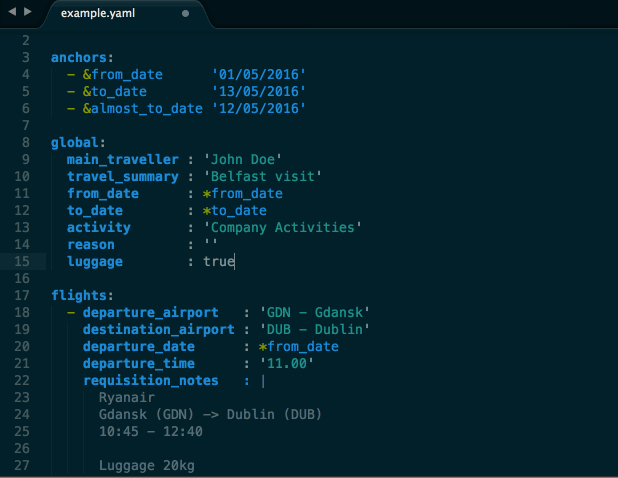
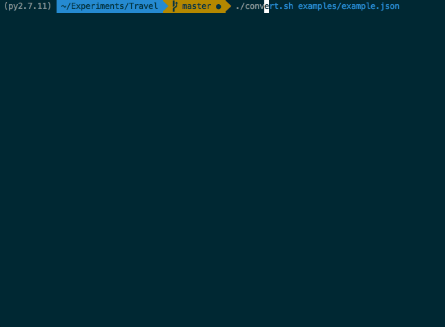
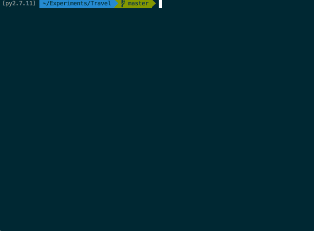
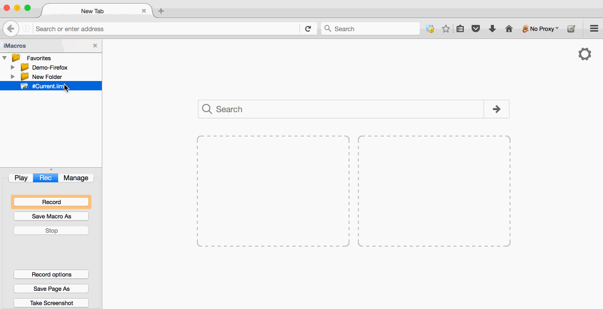

## Synopsis

Kimble-autotravel is a project which enables you to automate the creation of travel requests in Kimble. You provide it with a json of your travel request and the script will return the [iMacros](http://http://imacros.net/) script. This script can then be used to create the travel request with the iMacros addon, which is available for all major browsers. 

The python script is also exposed as an API endpoint in AWS, created using the [Serverless](https://github.com/serverless/serverless) project.

## Demo

### Prepare the input



### Pass the input to the API endpoint...



### ... or run it locally



### Create a new iMacro


### Edit the macro and paste the output of the API



### Run the iMacro


## Code Example

We will use YAML for our travel request, as it's a superset of JSON and is easier to read by humans. The travel request might look like this:

```
---

# Standard YAML anchors, you can define your own as you please
anchors:
  - &from_date      '01/05/2016'
  - &to_date        '13/05/2016'
  - &almost_to_date '12/05/2016'

global:
  main_traveller : 'John Doe'
  travel_summary : 'Belfast visit'
  from_date      : *from_date
  to_date        : *to_date
  # The activity value has to match EXACTLY the possible selection on the form
  # The same is true for all other selection based values in the form
  activity       : 'Company Activities'
  reason         : ''
  luggage        : true

flights: 
  - departure_airport   : 'GDN - Gdansk'
    destination_airport : 'DUB - Dublin'
    departure_date      : *from_date
    departure_time      : '11.00'
    requisition_notes   : |
      Ryanair
      Gdansk (GDN) -> Dublin (DUB)
      10:45 - 12:40

      Luggage 20kg

  - departure_airport   : 'DUB - Dublin'
    destination_airport : 'GDN - Gdansk'
    departure_date      : *to_date
    departure_time      : '06.00'
    requisition_notes   : |
      Ryanair
      Dublin (DUB) -> Gdansk (GDN)
      06:15 - 09:55

      Luggage 20kg

hotels:
  - check_in          : *from_date
    check_out         : *almost_to_date
    preference        : 'Dukes at Queens in Belfast'
    requisition_notes : ''

  - check_in          : *almost_to_date
    check_out         : *to_date
    preference        : 'Maldron Hotel Dublin Airport room only'
    requisition_notes : ''

trains:
  - departure_station   : 'Dublin Airport'
    departure_date      : *from_date
    departure_time      : '14.00'
    destination_station : 'Belfast (Europa Bus Centre)'
    requisition_notes   : 'Aircoach @ 13:55'

  - departure_station   : 'Belfast (Europa Bus Centre)'
    departure_date      : *almost_to_date
    departure_time      : '17.30'
    destination_station : 'Dublin Airport'
    requisition_notes   : 'Aircoach @ 17:30'

taxis:
  - departure_address   : 'ul. Dluga 1, Gdansk'
    departure_date      : *from_date
    departure_time      : '09:00'
    destination_address : 'Gdansk Airport'
    requisition_notes   : 'Phone: +48 123 345 678'

  - departure_address   : 'Gdansk Airport'
    departure_date      : *to_date
    departure_time      : '09:00'
    destination_address : 'ul. Dluga 1, Gdansk'
    requisition_notes   : 'Phone: +48 123 345 678'

# Any section and property is optional
# You can view the possible keys for sections 
# skipped for this travel request in the comments below

# cars:
#   - pickup            : ''
#     pickup_date       : ''
#     dropoff           : ''
#     dropoff_date      : ''
#     requisition_notes : ''

# other_travellers:
#   - name : ''
```

If such a travel request is saved to `travel.yaml`, you can get the iMacros script by running the following in the console:

```
convert.sh travel.yaml
```

The `convert.sh` script will run the following command in this case:

```
cat travel.yaml | ruby -e 'require "yaml"; require "json"; puts JSON.dump(YAML.load(STDIN.read))' | curl -H "Content-Type: application/json" -XPOST --data-binary '@-' https://201cz8f29l.execute-api.eu-west-1.amazonaws.com/prod/generate
```

This will convert the yaml file into json and post it into the AWS API Gateway endpoint, which will in turn run the AWS Lambda function that parses the json and returns the iMacro script.

You can alternatevily skip doing any API calls altogether, and just run the code on your machine. This requires installing the python dependencies first:

```
pip install -r requirements.txt -t serverless-autotravel-python/functions/lib
```

Afterwards you can run the `convert-local.sh` script, which will use the same code that runs on the AWS API Gateway endpoint, only locally:

```
convert-local.sh travel.yaml
```

While I don't store your travel requests in AWS Lambda, this way you can be sure that your top secret travel plans aren't being sent anywhere.

## Motivation

Manually filling travel requests is boring, especially if you frequently do the exact same request, with just the dates being different. Unfortunately Kimble doesn't allow duplicating existing travel requests, so a workaround had to be created.

My Kainos collegue @mat-ray has created a [script](https://github.com/mat-ray/batch-kimble-travel) that will automate the travel request using Apple Script. I liked the idea, but his solution supports only a narrow range of possible travel requests that fit into the predefined csv headings. Since it didn't fill my need and I didn't feel like learning Apple Script, I decided to create my own solution.

Aside from the ability to run the script locally, I also decided to host the converter program in the cloud, so that no additional items had to be installed on the user's computer. Though to be honest my main motivation is that I just wanted to play around with AWS Lambda and the Serverless framework :). When using the API, the user only needs to copy the `convert.sh` script from this repository. Alternatevily he could just curl the API himself, as shown in the section above. If someone creates a Windows script that does that, I'll gladly accept the pull request.

## Troubleshooting

#### The iMacro script isn't working at all

I didn't try it myself, but the comments on chrome web store suggest that the iMacros addon isn't currently working on Chrome (as of 15.04.2016). Try using it on a different browser - I used Firefox.

#### The iMacro script isn't filling the form correctly

This can happen especially if your network is slow, so you can try rerunning the script. If it always fails in the same place, then you might want to edit it and fix the error.

#### API ERROR: Could not parse request body into json

The request wasn't a valid json, which you can verify by pasting your file [online](http://jsonlint.com/)

#### API ERROR: The input failed validation

The API endpoint will check your json against a schema. If you get a validation error it means you have an error in your travel request - probably a typo. The error should explain what's wrong with the request.

#### API ERROR: An internal error occured during response generation

There's a bug in the code. Please report it to me and I'll see if I can fix it.


## License

MIT